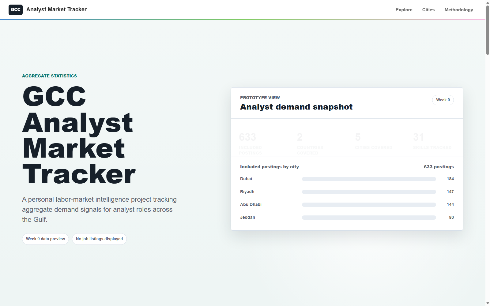

# GCC Analyst Market Tracker

GCC Analyst Market Tracker is a private-beta career intelligence project that turns sampled job-market data into weekly aggregate signals for analyst roles across the Gulf.

It is not a job board and it does not publish full job listings. The goal is to help students, graduates, job seekers, and career switchers understand what the analyst market appears to be asking for by city, role type, and skill.

[Public project page](https://maze291.github.io/)  
[Methodology note](docs/methodology-note.md)  
[Beta feedback brief](docs/beta-feedback-brief.md)



## What I Built

- A CSV-first data pipeline for sampled analyst-role market data.
- Normalization scripts that convert varied API responses into consistent local records.
- An automated review layer that classifies likely relevant analyst roles.
- A deduplication/history layer that creates unique reviewed-role snapshots.
- A skill taxonomy for grouping tools, technical skills, analytical skills, and business skills.
- A private local dashboard showing aggregate signals by city, country, role category, skill, source confidence, and trend movement.
- A public GitHub Pages landing page for the project, without exposing private dashboard data or provider details.

## Current Status

The tracker now has two dated core snapshots:

- First snapshot: May 9, 2026
- Latest snapshot: May 16, 2026
- Latest core market read: 633 unique reviewed roles
- Current core coverage: UAE and Saudi Arabia
- Current core cities: Dubai, Abu Dhabi, Riyadh, Jeddah, and Dammam
- Wider Gulf discovery is being tested separately before it is promoted into the main tracker.

Movement labels should be read as newly observed reviewed roles since the previous snapshot, not exact market growth.

## Why It Exists

Generic career advice often says things like "learn SQL" or "learn Power BI" without showing local evidence. This project tries to make those conversations more grounded by asking:

- Which analyst roles appear most often in the sampled market?
- Which cities show the strongest analyst-role signals?
- Which skills keep appearing across reviewed roles?
- Which role paths look different from each other?
- What changed since the previous weekly snapshot?

## Pipeline

```text
sample pull
  -> normalized CSVs
  -> relevance review
  -> duplicate handling
  -> skill extraction
  -> aggregate dashboard files
  -> dated trend snapshots
  -> private dashboard / Discord market updates
```

The repository intentionally keeps raw samples, local derived exports, and secrets out of git.

## Data Handling

The public-facing layer only uses aggregate outputs. It does not display:

- full job descriptions
- recruiter names
- emails or phone numbers
- direct application links
- raw API payloads
- API keys or private provider configuration

Counts are directional market signals from reviewed samples. They are not official labor-market totals.

## Dashboard

The private dashboard currently includes:

- current market read
- city and country concentration
- role category mix
- skill demand and skill taxonomy groups
- source confidence
- trend snapshots
- methodology notes

The public website is intentionally lighter. It explains the project and points people toward the beta/community flow without exposing the full working dashboard.

## Local Run

Create a local `.env` from the example file and add keys only on your own machine:

```powershell
Copy-Item .env.example .env
```

Run the local dashboard from the repository root:

```powershell
python -m http.server 8080 --bind 127.0.0.1
```

Open:

```text
http://127.0.0.1:8080/v1_dashboard/
```

Build the dashboard aggregates:

```powershell
python scripts\build_dashboard_aggregates.py
```

Build the history layer:

```powershell
python scripts\build_unique_jobs.py
python scripts\write_trend_snapshot.py
```

## What I Learned

- Sampled online job data is useful for directional career intelligence, but it should not be presented as a complete count of all jobs.
- Deduplication and relevance review matter as much as the initial pull.
- A narrow niche is easier to explain and test than a general job-market dashboard.
- The product value is not "more charts"; it is helping a user decide what role, city, or skill to pay attention to.
- A weekly brief may be more useful than expecting people to repeatedly open a dashboard.

## Next Steps

- Add repeated weekly snapshots.
- Improve deduplication across sources and reposts.
- Expand Gulf coverage gradually after repeated discovery samples.
- Strengthen skill taxonomy and role classification.
- Add a private review/admin workflow.
- Turn weekly outputs into Discord-native market updates.
- Decide whether the project is best as a portfolio product, research asset, paid report, or startup wedge.

